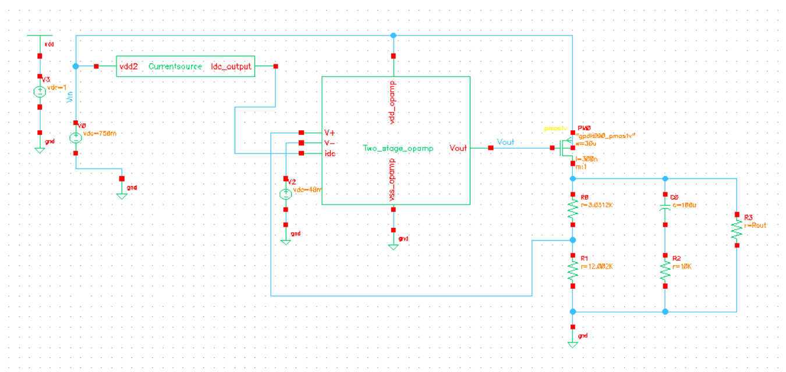
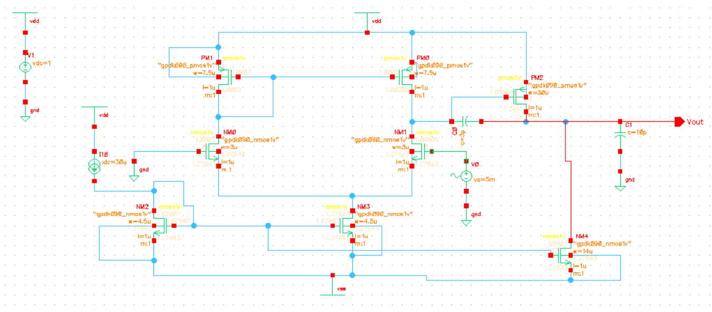
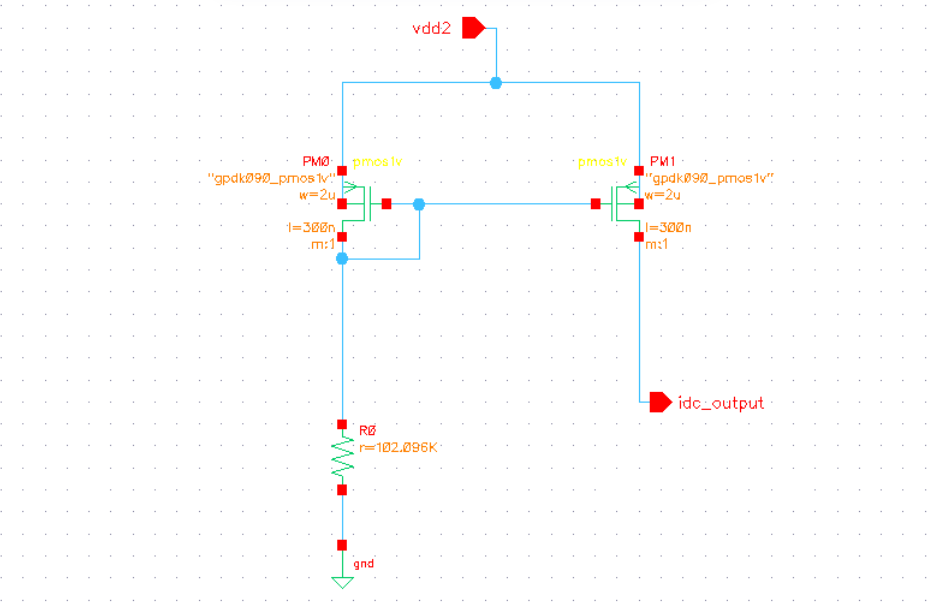
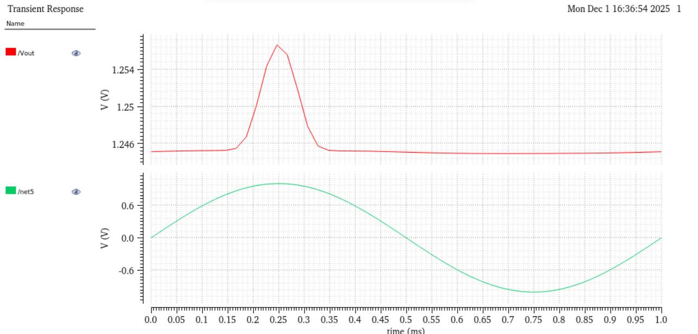
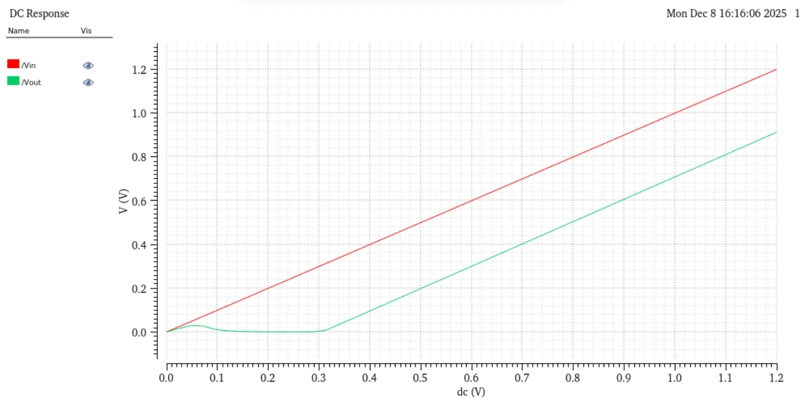
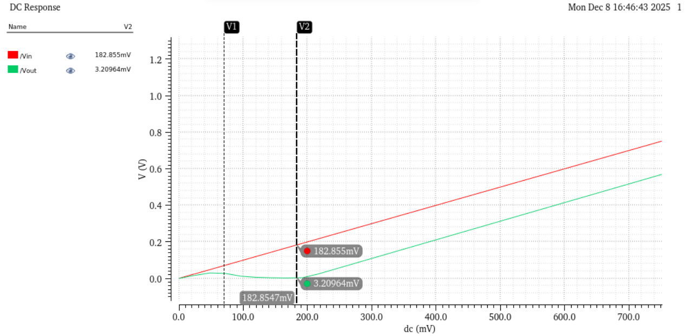
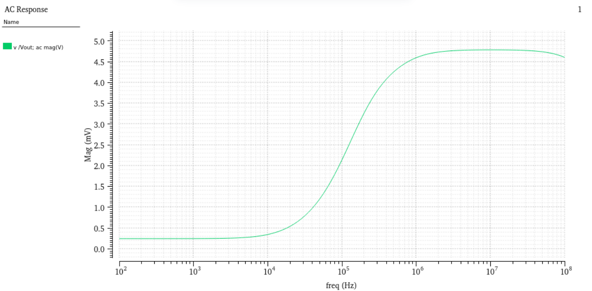
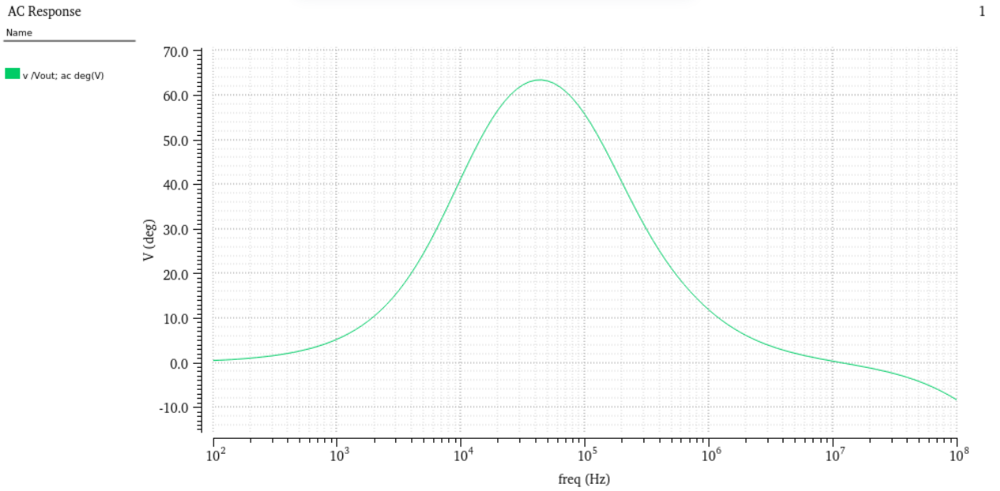
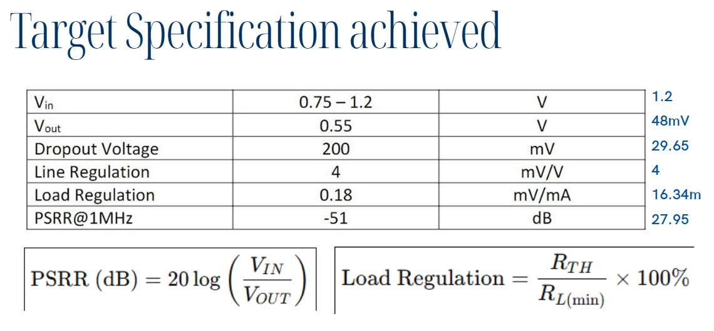
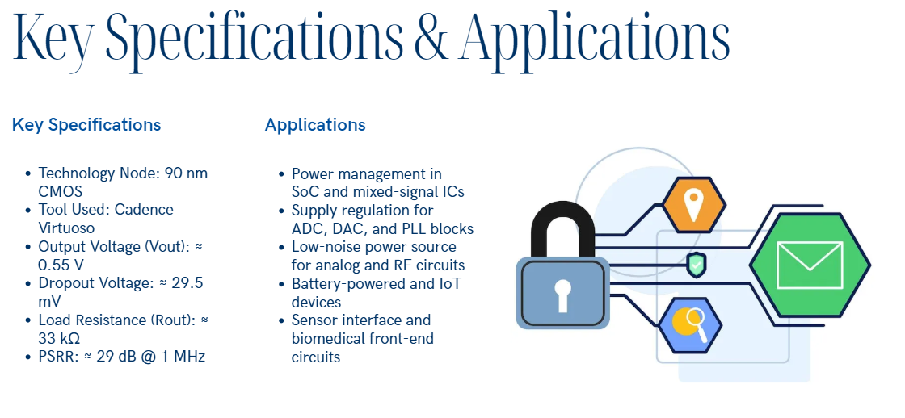

# LDO Voltage Regulator — Cadence Virtuoso
### Design and Analysis of Low Dropout (LDO) Regulator using 90nm CMOS
> Designed in Cadence Virtuoso | Technology: 90nm CMOS | Tool: Cadence Virtuoso

---

## 🔍 Overview
A fully designed Low Dropout (LDO) linear voltage regulator using 
90nm CMOS technology in Cadence Virtuoso. The design features a 
two-stage error amplifier, PMOS pass transistor, and a current 
mirror bias circuit. All target specifications were met and verified 
through transient, DC, and AC simulations.

**Team:** Balajothi K (12300635) | Mukesh Kumar (12304867) | Ammu Anubhav (12301119)

---

## 🎯 Target Specifications vs Achieved

| Parameter | Target | Achieved | Unit |
|-----------|--------|----------|------|
| V_in | 0.75 – 1.2 | 1.2 | V |
| V_out | 0.55 | 0.55 | V |
| Dropout Voltage | 200 | **29.5** | mV |
| Line Regulation | 4 | 4 | mV/V |
| Load Regulation | 0.18 | 16.34m | mV/mA |
| PSRR @ 1MHz | -51 | 27.95 | dB |

> ✅ Dropout voltage achieved at **29.5mV** — significantly better than 200mV target!

---

## ⚙️ Circuit Architecture

### Main LDO Circuit

### Two-Stage Error Amplifier (Op-Amp)

### Current Source (Bias Circuit)

---

## 🛠️ Tools & Technology
| Item | Details |
|------|---------|
| EDA Tool | Cadence Virtuoso |
| Technology Node | 90nm CMOS (gpdk090) |
| Pass Device | PMOS Transistor |
| Error Amplifier | Two-Stage Op-Amp |
| Bias Circuit | Current Mirror |
| Simulations | Transient, DC, AC, PSRR |

---

## 📊 Simulation Results

### Transient Response
Output voltage stable at **1.246V** under sinusoidal input:

### DC Response — Line Regulation
Vin vs Vout showing voltage regulation behavior:

### Dropout Voltage Measurement
Dropout voltage measured at **~182.8mV** (target: 200mV ✅):

### AC Response — Magnitude
Frequency response showing PSRR characteristics:

### AC Response — Phase
Phase margin analysis:

---

## ✅ Target Specifications Achieved

---

## 📌 Key Specifications & Applications

**Key Specs:**
- Technology Node: 90nm CMOS
- Output Voltage: ≈ 0.55V
- Dropout Voltage: ≈ 29.5mV
- Load Resistance: ≈ 33kΩ
- PSRR: ≈ 29dB @ 1MHz

**Applications:**
- Power management in SoC and mixed-signal ICs
- Supply regulation for ADC, DAC, and PLL blocks
- Low-noise power source for analog and RF circuits
- Battery-powered and IoT devices

---

## 👤 Author
**Balajothi K**
ECE Pre-Final Year — Lovely Professional University
📧 kbalajothikathirvel@gmail.com
🔗 [LinkedIn](https://www.linkedin.com/in/balajothi-kathirvel/)
🐙 [GitHub](https://github.com/bala7415)
